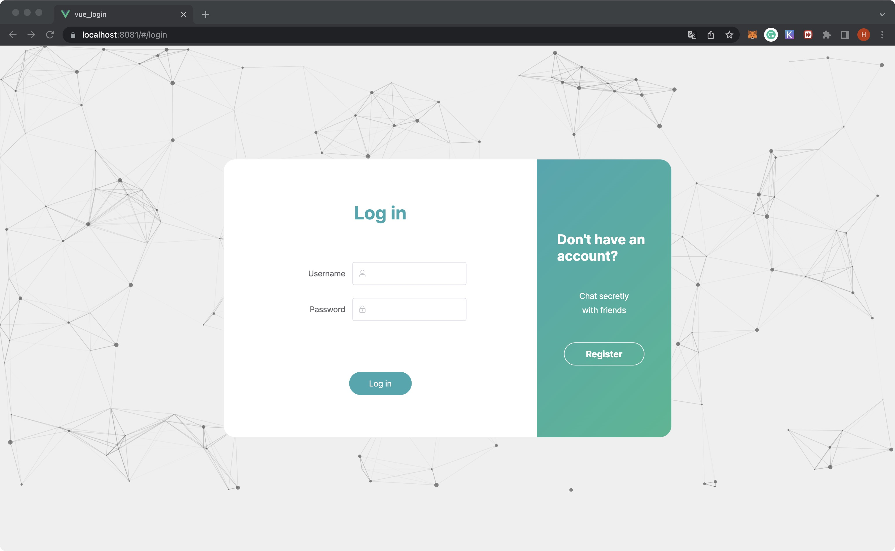
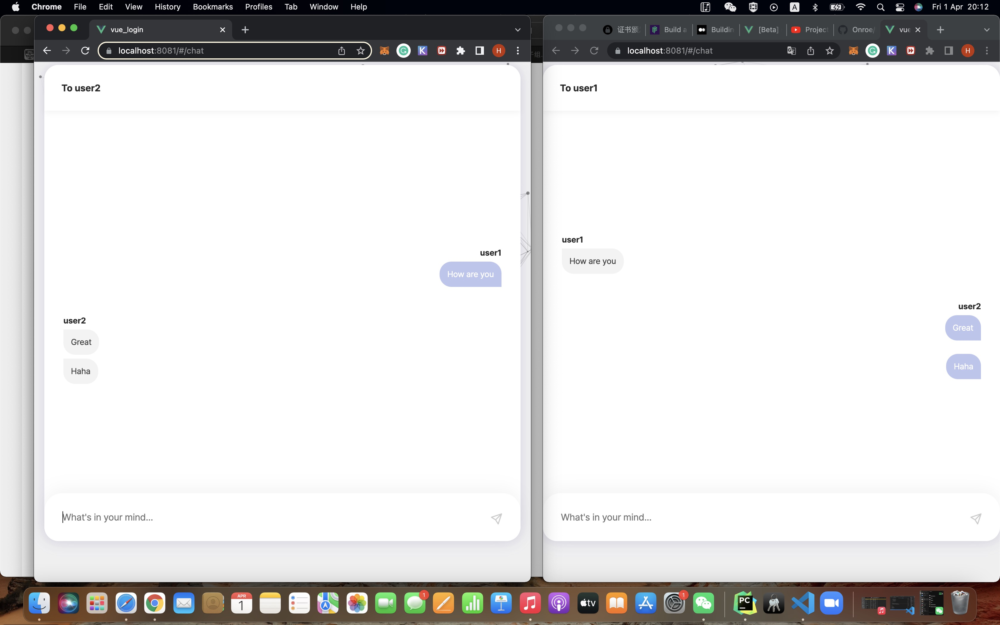
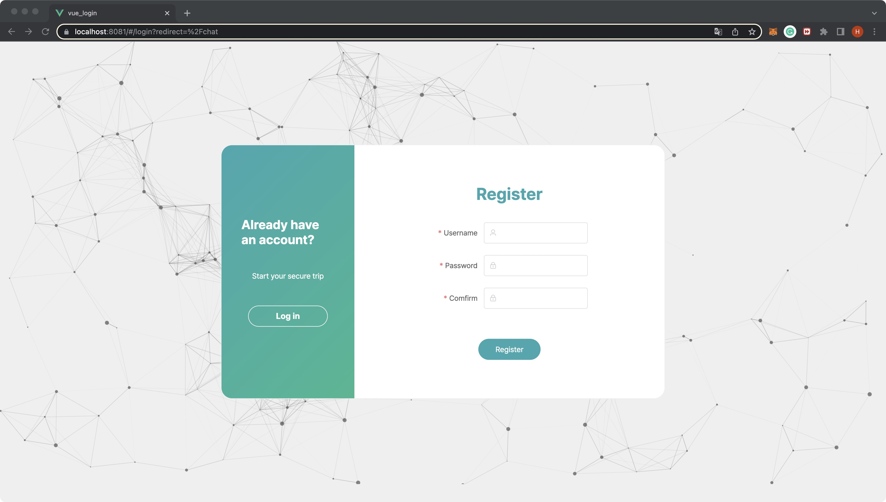
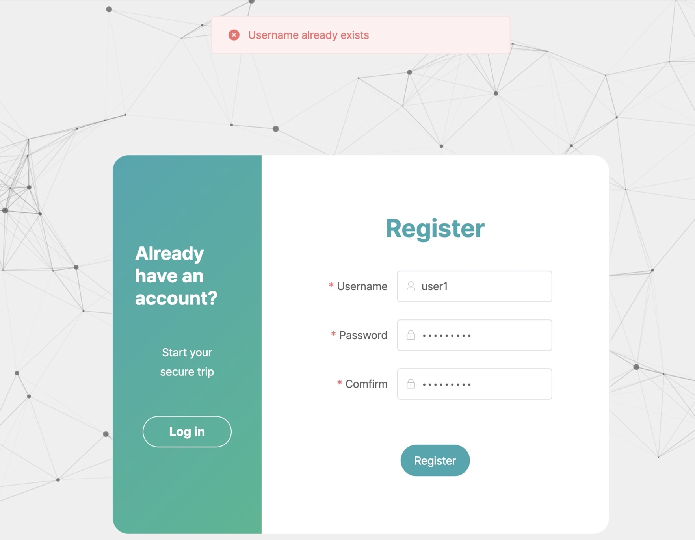
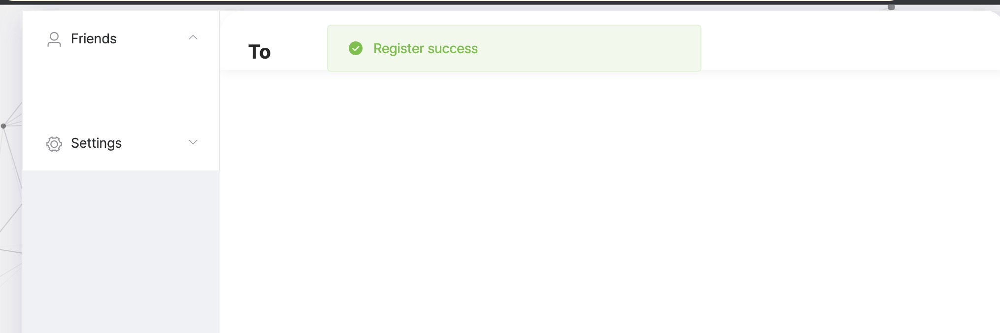
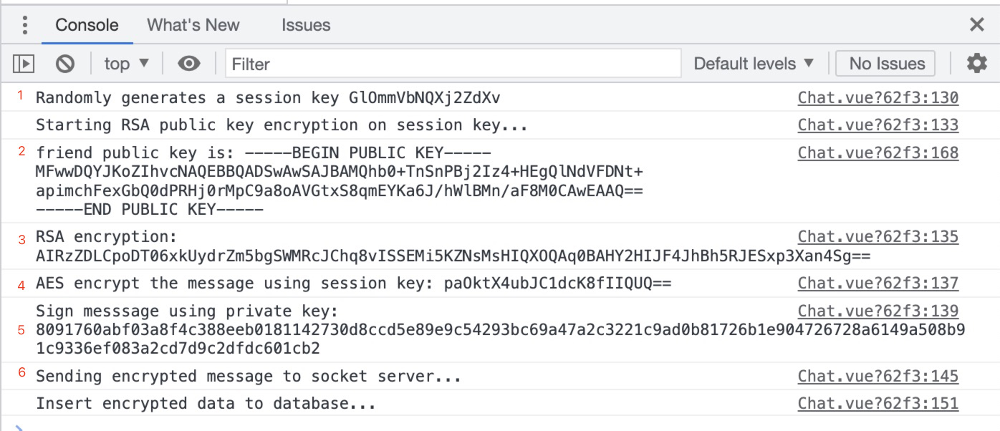
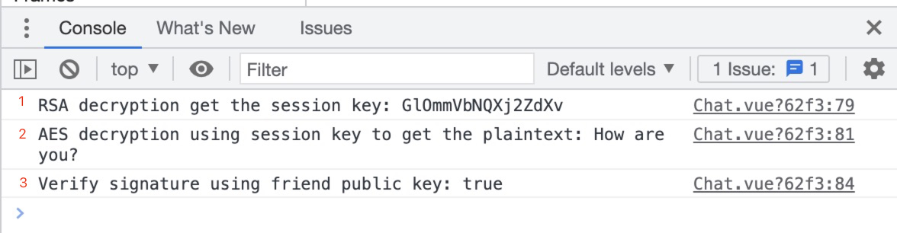

# Project
This repository is for University of Sydney INFO2222 assignment 1, based on vue.js and flask. One-to-one private chat using Vue.js, Flask, Socket.io, Sqlite3.
> If you like this project, please smash Star for me! I'll put it on resume and you can help me to find a job :]

## Preface


###  Prerequisites
- [Python 3.6+](https://www.python.org/)
- [Node.js](https://nodejs.org/) version 8.9 or above
- [Vue cli](https://cli.vuejs.org/guide/installation.html)
- [socketio](https://socket.io/)
- Sqlite3


### Setting up the project to run on a local machine
First, clone this repository to your local machine:

```sh
$ git clone https://github.com/Lawson-Han/vue-flask-private-chat.git
```

### Running the App

#### Extract the files 

- Using your python terminal, navigate into the - api folder to install dependencies:

```
$ pip install -r requirements.txt
```

- Run the api:
```
$ flask run
```

#### Run the frontend
Open a new nodejs terminal window, then navigate to the frontend folder `cd vue-login-test`

Install dependencies:
```sh
$ npm install
```

Then run the app:

```sh
$ npm run serve
```
OR using Vue GUI

```sh
$ vue ui
```

and do `run tasks`


Check the URL  - https://localhost:8081/login to start to login.






## Components

- api (flask)
  - app.py  - *connect the route from frontend*
  - model.py - *handle the combination between app.py & database.py*
  - database.py - *do database operation*
  - test_db.db - *store all data we need*
- src (vue)
  - assets
    - css - *the stylesheet used in pages*
  - components
    - Chat.vue - *Chat page* 
      - ChatForm.vue - *the simple input form*
      - ChatList.vue - *the main page showing chatting contents*
      - ChatMessage.vue - *the message logicstics*
    - Login.vue - *Login & Register page*
  - plugins
    - axios.js - *transmitting between frontend & backend*
    - element.js - *a Desktop UI Library*
    - socketPlugin.js - *socket server for end-to-end messaging*
  - router
    - index.js - *handling page jumping & navigating*
  - ssl - *consists of localhost signature ca.cert*
  - App.vue - *main page of template*
  - main.js - *main javascript function we used in the whole project*
  - AES.js - *symmetric encrption in sending secret message*
  - vue.config.js - *https enable and axios agent*


## Workflow

### Register

Click on register button will navigate to a symmetric registeration page.



After using a legal combination to sign up, vue components will do md5-salt encryption on password.

```javascript
// - javascript
const md5 = crypto.createHash('md5')
// salt - a 10 digits random string
const salt = this.salt()
// combine them -> a new hashed password
md5.update(password + salt)
```

Then we generate the public key and private key for them, the public one should store into database with hashed password, the private key should store in browser (session storage). The database then consists of:

 *Users (id, username, hashed_password, salt, publicKey, friends)*

If no errors raised in the process, alert a successful message and jump into the chat page.

**Error:**



**Success:**



### Login

The login checking function retrieves data from database and then acts like:

```javascript
// javascript
const md5 = crypto.createHash('md5')
md5.update(password + salt)
const result = md5.digest('hex')
if (result === database_result) {
  return true
} else {
  return false
```

There's no any plain text in the backend, all operations should be done in frontend locally.


### Chat

The chatting between Alice and Bob workflow was decribed as following two parts: Send & Receive

##### Send



1. Randomly generates a session key using javascript, if Alice clicks on a chat channel.

2. Retrieving current friend data: {friend: 'Bob', publicKey: 'FRIEND'S_PUBLIC_KEY}

3. After Alice send the message, firstly do a RSA encryption on the session key using Bob's public key.

   ```javascript
   /* javascript - import JSEncrypt from 'jsencrypt' */
   const jsencrypt = new JSEncrypt()
   jsencrypt.setPublicKey(this.friend_publicKey)
   const result = jsencrypt.encrypt(sessionKey)
   ```

4. Using the encrypted session key to do AES encryption on the plain message.

   ```javascript
   /* javascript - import CryptoJS from 'crypto-js' */
   encrypt (word, keyStr) {
     var key = CryptoJS.enc.Utf8.parse(keyStr)
     var srcs = CryptoJS.enc.Utf8.parse(word)
     var encrypted = CryptoJS.AES.encrypt(srcs, key, { mode: CryptoJS.mode.ECB, padding: CryptoJS.pad.Pkcs7 })
     return encrypted.toString()
   },
   ```

5. Use Alice's private key to sign the plain message by MD5-RSA.

   ```javascript
   Vue.prototype.$signature = function (strIng, key) {
     // ger rid of `----BEGIN----` and `----END----``
     var signPrivateKey = jsRsasign.KEYUTIL.getKey(key)
     var sig = new jsRsasign.KJUR.crypto.Signature({ alg: 'MD5withRSA', prov: 'cryptojs/jsrsa', prvkeypem: signPrivateKey })
     sig.init(signPrivateKey)
     sig.updateString(strIng)
     return sig.sign()
   }
   ```

6. Send the array of message combination: ` [Encrypted(sessionKey), Encrypted(message), Signature]` to the socket server.


##### Receive



1. Use `this.socket.on('RESPONSE', (data))` under *vue-mounted()* so can keep listening socket server, and use Bob's private key to decrypt the RSA.

   ```javascript
   rsaPrivateData (data) {
     const jsencrypt = new JSEncrypt()
     jsencrypt.setPrivateKey(sessionStorage.getItem('privateKey'))
     const result = jsencrypt.decrypt(data)
     return result
   }
   ```

2. Use the session key we just get to do AES decryption on cipher message.

   ```javascript
   decrypt (word, keyStr) {
     var key = CryptoJS.enc.Utf8.parse(keyStr)
     var decrypt = CryptoJS.AES.decrypt(word, key, { mode: CryptoJS.mode.ECB, padding: CryptoJS.pad.Pkcs7 })
     return CryptoJS.enc.Utf8.stringify(decrypt).toString()
   }
   ```

3. Verify the signarue from Alice. If not verified, discard the message and alert Bob with message.

   ```javascript
   /**
    * Verify signature
    * @param {String} strIng - plain text
    * @param {String} data - cipher text
    * @return {Boolean} true | false
    */
   Vue.prototype.$testSignature = function (strIng, data, key) {
     var signPublicKey = jsRsasign.KEYUTIL.getKey(key)
     var sig = new jsRsasign.KJUR.crypto.Signature({
       alg: 'MD5withRSA',
       prov: 'cryptojs/jsrsa',
       prvkeypem: signPublicKey
     })
     sig.updateString(strIng)
     return sig.verify(data)
   }
   ```


## Additional security features

### Security background 

In order to achieving the secure E2E Encryption between two user's communication and avoid the server from modifying the data, the simple backgroud is provided below.

Firstly , after both users have successfully registered themselves, they have to create their own public key and private key and store their own private key in the frontend, sending their public key to the server and store it in the database with the  format of  

```
id INTEGER PRIMARY KEY AUTOINCREMENT,
            username TEXT UNIQUE,
            password TEXT NOT NULL,
            salt INTEGER NOT NULL,
            pk TEXT NOT NULL,
            friend TEXT NOT NULL
```

then if the user 1 want to start a communicatiing with user 2, user 1 need to retrieve his friend list from the server first the example result will be as below 

```
result = {'friend': friend, 'publicKey': pk}
```

after that user 1 needs to generate a session key with user 2 in order for symmetric encryption communication and encrypts the message with that session key.  Using user2 ‘s public key to encrypt the session key and encrypt the message using the session key. sending them together with the signiture to user2, in addition, the signiture will be generated by user1's private key , so user'1 public key can be used to decrypt it. 

when user2 received the message, user2's private key can used to decrypt the session key and  using the session key the decrypt the message. futher more , signiture can be used to verify whether the message is true, checking with user1's public key, if the message in signiture don't match, then it indicate that the message is fake. 

throughing this way, the message have already encrypted as a ciphertext before touching to the server, more specific detail will be provide below 

### Vue.js - frontend

1. **HTTPS**

   In *vue.config.js*, we are supposed to initialise the HTTPS mode. It's pretty easy to turn it on in *Vue.js*.

   ```js
   // vue.config.js
   module.exports = {
     devServer: {
       host: 'localhost',
       port: 8081,
       open: true,
       // `https: true` would be enough
       https: {
         cert: fs.readFileSync(path.join(__dirname, 'src/ssl/cert.crt')),
         key: fs.readFileSync(path.join(__dirname, 'src/ssl/cert.key'))
       }
     }
   }
   ```

   Only using `https: true` would be enough in this case, but we don't want to see some messages like *Your connection is not private*. Therefore, we can use *mkcert* to generate a locally trusted certificate for the *localhost*. Then there's no risk alert anymore.

   

2. **Potential XSS attack - Vue.js framework**

   **HTML content**

   In Vue.js, whether using templates or render functions, content is automatically escaped. That means in this template:

   ```
   <h1>{{ userProvidedString }}</h1>
   ```

   if `userProvidedString` contained:

   ```
   '<script>alert(1)</script>'
   ```

   then it would be escaped to the following HTML:

   ```
   &lt;script&gt;alert(&quot;hi&quot;)&lt;/script&gt;
   ```

   thus preventing the script injection. This escaping is done using native browser APIs, like `textContent`, so a vulnerability can only exist if the browser itself is vulnerable.

   **Attribute binding**

   Similarly, dynamic attribute bindings are also automatically escaped. That means in this template:

   ```
   <h1 v-bind:title="userProvidedString">
     hello
   </h1>
   ```

   if `userProvidedString` contained:

   ```
   '" onclick="alert(\'hi\')'
   ```

   then it would be escaped to the following HTML:

   ```
   &quot; onclick=&quot;alert('hi')
   ```

   thus preventing the close of the `title` attribute to inject new, arbitrary HTML. This escaping is done using native browser APIs, like `setAttribute`, so a vulnerability can only exist if the browser itself is vulnerable.

3. **Route-guard**

   We are not allowed get into /chat without logging in, and not allowed re-login after logged in. In addition, just don't try to access any other page except for '/login' and 'chat', otherwise do page redirection.

   ```javascript
   /* @/router/index.js */
   const router = new VueRouter({
     routes: [
       { path: '/login', component: Login },
       { name: 'chat', path: '/chat', component: Chat, meta: { loginRequired: true } },
       { path: '*', redirect: '/login' }
     ]
   })
   router.beforeEach((to, from, next) => {
     if (to.path !== '/login') {
       if (to.meta.loginRequired) {
       // If heading to **loginRequired**
         if (sessionStorage.getItem('username')) {
           // If we have logged in, move!
           next()
         } else {
           // Redirect to login!
           next({
             path: '/login',
             query: { redirect: to.fullPath } 
           })
         }
       } else {
         next()
       }
     // Don't try to re-login :]
     } else if (sessionStorage.getItem('username')) {
       next('/chat')
     } else {
       next()
     }
   })
   ```

4. **Form-validation**

   The *login & register* form should have its own static rule validating the input before checking in database, it's easily implemented using vue-element.js.

   

```javascript
loginFormRules: {
  username: [
    { required: true, message: 'Empty username', trigger: 'blur' },
    { min: 3, max: 10, message: 'Between 3 to 10 characters', trigger: 'blur' },
    { pattern: /^[A-Za-z0-9]+$/, message: 'Only alphanumeric characters' }
  ],
  password: [
    { required: true, message: 'Empty password', trigger: 'blur' },
    { min: 8, max: 15, message: 'Between 8 to 15 characters', trigger: 'blur' },
    { pattern: /^[A-Za-z0-9]+$/, message: 'Only alphanumeric characters' }
  ],
  confirm: [
    { required: true, message: 'Empty password', trigger: 'blur' },
    { validator: checkConfirm, message: 'Password is not the same', trigger: 'blur' }
  ]
}
```

### Flask - backend

1. **SQL injection**

   Parameterized queries do proper substitution of arguments prior to running the SQL query. It completely removes the possibility of dirty input changing the meaning of your query. That is, if the input contains SQL, it can't become part of what is executed because the SQL is never injected into the resulting statement.

   Some example code in our project:

   ```python
   # Check login credentials
   def check_credentials(self, username, password):
     sql_query = """
                   SELECT id
                   FROM Users
                   WHERE username = ? AND password = ?
               """
     result = self.fetchone(sql_query, (username, password,))
     return result
   ```
